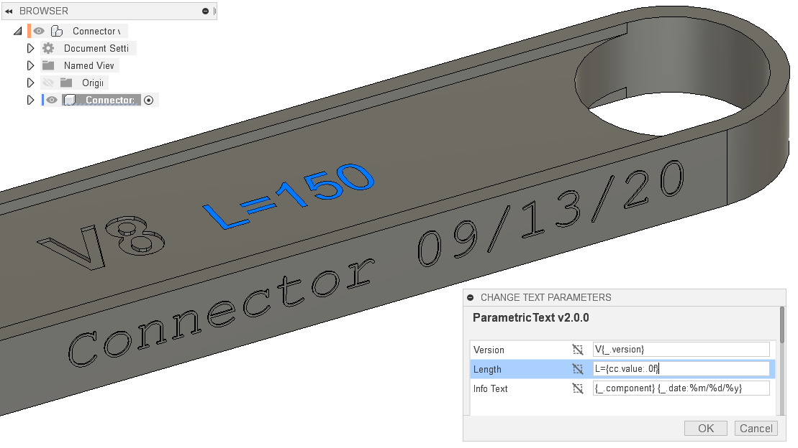

#  ParametricText

ParametricText is an Autodesk® Fusion 360™ add-in for creating *Text Parameters* in sketches.

## Supported Platforms

* Windows
* Mac OS

## Documentation

https://parametrictext.readthedocs.io/en/stable/

## More Fusion 360™ Add-ins

[My Fusion 360™ app store page](https://apps.autodesk.com/en/Publisher/PublisherHomepage?ID=JLH9M8296BET)

[All my add-ins on Github](https://github.com/topics/fusion-360?q=user%3Athomasa88)
