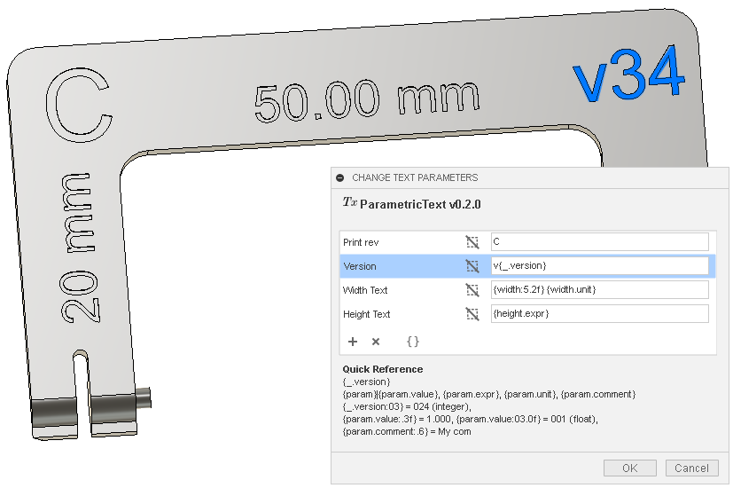

#  ParametricText

ParametricText is an Autodesk® Fusion 360™ add-in for creating *Text Parameters* in sketches.

Text parameters can be pure text or use parameter values by using a special syntax. There is also a special parameter, that contains information about the document's version and save date.

All parameters are stored within in the document upon save. The texts are always "rendered" in the sketches, so they can be viewed without having the add-in. However, to correctly update the values, the add-in is needed.

## Supported Platforms

* Windows
* Mac OS

## Installation

Download the add-in from the [Releases](https://github.com/thomasa88/ParametricText/releases) page.

Unpack it into `API\AddIns` (see [How to install an add-in or script in Fusion 360](https://knowledge.autodesk.com/support/fusion-360/troubleshooting/caas/sfdcarticles/sfdcarticles/How-to-install-an-ADD-IN-and-Script-in-Fusion-360.html)).

Make sure the directory is named `ParametricText`, with no suffix.

## Usage

Please see the [Demo video](https://knowledge.autodesk.com/support/fusion-360/learn-explore/caas/screencast/Main/Details/3d4a64a7-37b3-4551-83c4-a93a4d96bca7.html) for a quick overview of ParametricText.

To parameterize texts, create sketches with Text features. Make sure to enter some dummy text, to make the Text features easier to select. Also, since Fusion 360™ resets some text settings when a text is modified by an add-in, it is recommended to not position the text in any way until it has been assigned a text parameter.

Open the *Modify* menu under e.g. the *SOLID* tab and click *Change Text Parameters*.

Use the `+` and `x` buttons to add and remove rows from the table.

To specify what sketch texts to affect, click the desired row and then select the sketch texts in the design. Use the clear button () to clear the selections.

Enter the text in the text field. The text can contain values from parameters. See [Parameters](#parameters).

The various buttons with braces (`{}`) allows for quickly inserting parameters.

Enabling *Run Compute All automatically* will make ParametricText run *Compute All* every time text parameters are updated. This can be needed for geometry depending on the texts to be redrawn.

Press OK to save the changes.

The add-in can be temporarily disabled using the *Scripts and Add-ins* dialog. Press *Shift+S* in Fusion 360™ and go to the *Add-Ins* tab.

## Parameters

ParametricText has basic support for including parameter values using [Python Format Specifiers](https://docs.python.org/3/library/string.html#formatspec). By writing `{parameter}`, the text is substituted by the parameter value. E.g., if the parameter *d10* has the value 20, `{d10}` becomes `20.0`.

The special parameter `_` gives access to special values, such as document version.

`_.date` supports [Python strftime()](https://docs.python.org/3/library/datetime.html#strftime-and-strptime-format-codes) formatting. E.g., `{_.date:%Y}` will show the year that the document was saved.

### Available Parameter Expressions

The following table shows the parameter values that can be used in ParametricText. *parameter* represents any numerical parameter defined in Fusion 360™, such as `d39` or `length`.

| Field Value (within `{}`)              | Description                                                  | Example Result     |
| -------------------------------------- | ------------------------------------------------------------ | ------------------ |
| `_.version`                            | Document version                                             | `24`               |
| `_.file`                               | Document filename                                            | `Crank`            |
| `_.component`                          | Name of the component which the Sketch belongs to            | `Handle`           |
| `_.sketch`                             | Name of the sketch. Makes it possible to edit texts directly in the Browser. | `Sketch4`          |
| `_.date`                               | Document save date                                           | `2020-09-27`       |
| *`parameter`* or *`parameter`*`.value` | Parameter value                                              | `10.0`             |
| *`parameter`*`.comment`                | Parameter comment                                            | `Width of the rod` |
| *`parameter`*`.expr`                   | Parameter expression, as entered by the user                 | `5 mm + 10 mm`     |
| *`parameter`*`.unit`                   | Parameter unit                                               | `mm`               |

### Parameter Substrings

Parameter values that are textual (`_.file`, `_.component`, *`parameter`*`.comment`) can be cut into substrings using the Python slice notation: `[start:stop]` (the `step` option is not supported).

The range is left-inclusive and right-exclusive, meaning that a range of `[2:4]` will give the characters at index `2` and `3`, but not `4`.

The character position is zero-indexed, which means that the first character will be number `0`.

Note: The length of numberic parameters can be adjusted using the Python Format Specifiers, as shown in a later section.

| Field Value (within `{}`)    | Description                                           | Example Result |
| ---------------------------- | ----------------------------------------------------- | -------------- |
| `_.file[0:3]`                | First three characters (0 through 2) of the filename. | `Cra`          |
| `_.component[2]`             | Character `2` (the third character in the string)     | `n`            |
| *`parameter`*`.comment[-3:]` | The last three characters of the parameter comment    | `rod`          |
| *`parameter`*`.comment[6:]`  | All characters from index `6`.                        | `of the rod`   |

### Parameter Usage Examples

The following table shows examples on how to access values and format parameters.

| Value                   | Result                                            |
| ----------------------- | ------------------------------------------------- |
| `{d1:.3f} {d1.unit}`    | `15.000 mm` (3 decimal places)                    |
| `{d1:03.0f}`            | `015` (Float/decimal zero-padded to three digits) |
| `{width:.0f}`           | `6` (No decimal places)                           |
| `{width.expr}`          | `6 mm`                                            |
| `{height.expr}`         | `2 mm + width`                                    |
| `{height.comment}[0:5]` | `The h`                                           |

### Special Parameter Usage Examples

The following table shows examples of using the special parameter `_`.

| Value                   | Result                                                       |
| ----------------------- | ------------------------------------------------------------ |
| `{_.version}`           | `5`                                                          |
| `v{_.version:03}`       | `v005` (Integer zero-padded to three digits)                 |
| `{_.file}`              | `Crank`                                                      |
| `{_.file} v{_.version}` | `Crank v5`                                                   |
| `{_.component}`         | `Handle`                                                     |
| `{_.sketch}`            | `My description`                                             |
| `{_.date}`              | `2020-09-27` (Current date, in ISO 8601 format)              |
| `{_.date:%m/%d/%Y}`     | `09/27/2020` (Month, day, year)                              |
| `{_.date:%U}`           | `40` (Current week, that starts on a Sunday)                 |
| `W{_.date:%W}`          | `39` (Current week, that starts on a Monday, prefixed with "W") |
| `{_.date:%H:%M}`        | `14:58`1 (Hour, second)                           |

1 Note: The time of day is "unstable". The time of day will be set a few seconds before the save time, when saving, and on the next change of text parameters, the time will jump to the correct save time.

## Known Limitations

* *Compute All* does currently not update the text parameters.
* `{` and `}` cannot be entered in string inputs in Fusion 360™ on keyboards where they require *Alt Gr* to be pressed.
  * Workaround is to use the `{}` button.
* The mouse pointer must be moved before clicking on the same sketch text again, to select/unselect.
* `_.file` does not update on file rename/copy.
  * Workaround is to open the *Change Text Parameters* and click *OK* in the new document.

## Migrating from Version 1.x to 2.x

A new storage format was introduced in version 2, to accommodate new features. If you load a document created with the old version, you will be prompted to update the text parameters to the new version.

After updating the text parameters, they can no longer be edited with the old version.

It is recommended to save the document before doing the update, to have a backup.

## Reporting Issues

Please report any issues that you find in the add-in on the [Issues](https://github.com/thomasa88/ParametricText/issues) page.

For better support, please include the steps you performed and the result. Also include copies of any error messages.

## Author

This add-in is created by Thomas Axelsson.

## License

This project is licensed under the terms of the MIT license. See [LICENSE](LICENSE).

## More Fusion 360™ Add-ins

[My Fusion 360™ app store page](https://apps.autodesk.com/en/Publisher/PublisherHomepage?ID=JLH9M8296BET)

[All my add-ins on Github](https://github.com/topics/fusion-360?q=user%3Athomasa88)

## Changelog

* v 2.2.0
  * Workaround for Fusion 360™ giving error when inspecting some selections, which broke the name tracking for `_.component`, `_.file` and `_.sketch`.  
  * Do not show an add-in error when *Compute All* fails. Instead, show an error notification.
* v 2.1.0
  * Fix Fusion 360 crash in non-parametric mode, by not calling *Compute All* in non-parametric mode.
  * Only run automatic *Compute All* if there are any text parameters that have been updated.
  * Text substrings using Python slice operator.
  * Add `_.sketch`
* v 2.0.0
  * Rewritten selection engine.
    * Handle selection of texts in multi-occurrence components better.
    * "Inherit" sketch parameters when pasting using *Paste New*.
  * New parameter values: `_.component`, `_.file`
  * Storage format version 2, to handle the new selection engine.
  * Only one Undo item for text updates (not applicable to document save).
  * Show count of texts selected in each sketch.
  * Option to run *Compute All* automatically, to force features to update.
  * Detect missing *thomasa88lib* helper library.
  * Quick buttons for prepending braces and appending common parameters.
* v 1.1.0
  * `_.date` for retrieving document save date.
  * Workaround for [Fusion 360™ bug](https://forums.autodesk.com/t5/fusion-360-api-and-scripts/cannot-select-shx-fonts-on-sketchtext-object/m-p/9606551) when using Autodesk® SHX fonts.
  * Informative error when a text has a negative angle.
  * Don't re-evaluate texts when the Change Parameters dialog is closed without any changes.
  * Handle unit-less parameter values.
* v 1.0.1
  * Fix error when using `_.version` in documents that have never been saved.
  * Redesign logo to comply with app store.
* v 1.0.0
  * Out of beta!
* v 0.2.1
  * Set table height to 10 rows.
  * Fix #1. Handle unsaved documents.
* v 0.2.0
  * Basic support for Python format specifiers.
  * *Insert braces* button.
  * Selection tooltip, to show all selections when the text is truncated.
  * Hide "select control". Integrate clear button into table.
  * Use correct unit/scaling when showing parameter value.
  * Quick reference in dialog.
* v 0.1.1
  * Enable *Run on Startup* by default.
* v 0.1.0
  * First beta release