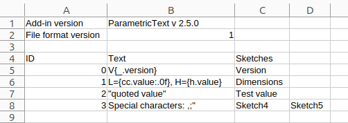

.. _import-export:

Export and Import
=================

The text parameters saved in a design can be exported to an Excel style CSV file.
The CSV file can then be edited in e.g. Excel or Libreoffice Calc and imported back into the design.

Export and Import actions
-------------------------

The following buttons are available in the :ref:`parameter-dialog`.

.. |btn_export| image:: images/resources/export/16x16.png
                       :class: guilabel

.. |btn_import_template| image:: images/resources/import_template/16x16.png
                       :class: guilabel

.. |btn_import_update| image:: images/resources/import_update/16x16.png
                       :class: guilabel

|btn_export| *Export*
  Exports the current text parameters to a CSV file.

  CSV Fields: ID, Text, Sketches

|btn_import_update| *Set text parameters from CSV file*
  Sets parameter values from an earlier exported and edited CSV file.
  The ID on each row on the CSV is used to map the text to the corresponding parameter.
  The IDs can be non-contiguous.

  Used CSV fields: ID, Text

|btn_import_template| *Add texts from CSV file*
  Adds text parameters from an earlier exported and edited CSV file. No new parameter will be inserted if a text matches an existing text parameter value.

  Used CSV fields: Text

CSV format
----------

An example of the CSV file format is shown below.
It follows the formatting of CSV files exported from Excel.
The first set of lines contain metadata that should not be edited.

.. code-block:: text
   :caption: Example of a CSV file opened in a text editor

    Add-in version,ParametricText v 2.5.0
    File format version,1
    
    ID,Text,Sketches
    0,V{_.version},Version
    1,"L={cc.value:.0f}, H={h.value}",Dimensions
    2,"""quoted value""",Test value
    3,"Special characters: ,;""",Sketch4,Sketch5

Saving in a spreadsheet application can add extra columns (commas) to unify the column count between the lines. These are ignored by the add-in.

  
   Example of a CSV file opened in Libreoffice Calc.

CSV fields
^^^^^^^^^^

*ID*
  A unique identifier for the text parameter used by the add-in to keep track of the text parameters.
*Text*
  The text of the parameter. 
*Sketches*
  The sketches that are assigned to the text parameter. One column for each assigned sketch.
