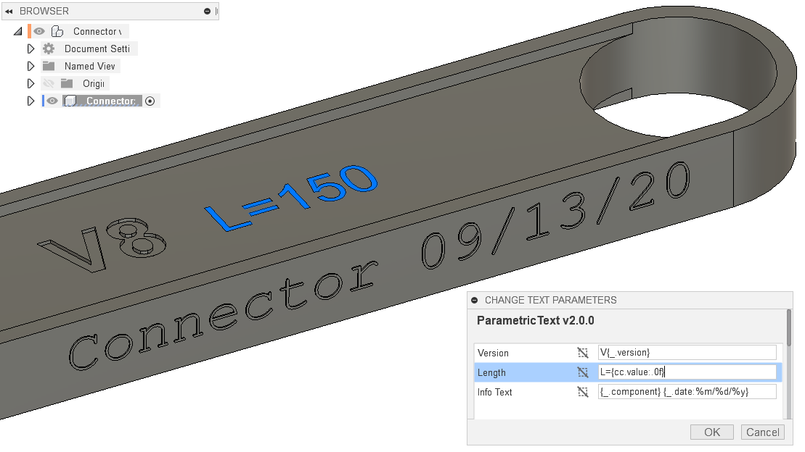

ParametricText
==============

.. toctree::
   :hidden:

   Introduction <self>

.. toctree::
   :hidden:
   :maxdepth: 2

   changelog
   quick_start
   installation
   usage
   parameters
   export
   issues
   about
   addins
             
ParametricText is an Autodesk® Fusion add-in for creating *Text
Parameters* in sketches.

Text parameters can be pure text or use parameter values by using a
special syntax. There is also a special parameter (``_``), that contains
information about the document’s version and save date.

All parameters are stored within in the document upon save. The texts
are always “rendered” in the sketches, so they can be viewed without
having the add-in. However, to correctly update the values, the add-in
is needed.

   ParametricText in action

Fusion's built-in text parameters
---------------------------------

Fusion introduced its own text parameters in the September 2025 release.
ParametricText supports showing the values of these parameters, but is in all
other ways completely separate from Fusion's own text parameters.

Demo Video
----------

.. raw:: html
   :file: _static/video.html

Indices and tables
==================

* :ref:`genindex`
* :ref:`modindex`
* :ref:`search`
