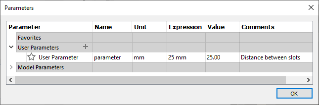

Parameters
==========

ParametricText has basic support for including parameter values using
`Python Format
Specifiers <https://docs.python.org/3/library/string.html#formatspec>`__.
By writing ``{parameter}``, the text is substituted by the parameter
value. E.g., if the parameter *d10* has the value 20, ``{d10}`` becomes
``20.0``. ``{d10:.3f}`` becomes ``20.000`` (3 decimals).

The special parameter ``_`` gives access to special values, such as
document version.

Document Parameters
-------------------

.. FIX issue about default number of decimals! update the table

Both model and user parameters can be used as input for the parametric text. The following properties are accessible.

+-------------------+----------+------------+----------+
| Property          | Type     | Description|Example   |
|                   |          |            |Value     |
+===================+==========+============+==========+
| parameter.unit    | string   |Parameter   |mm        |
|                   |          |unit        |          |
+-------------------+----------+------------+----------+
| parameter.expr    | string   |Parameter   |25 mm     |
|                   |          |expression  |          |
+-------------------+----------+------------+----------+
| parameter         | decimal  |Parameter   |25.0      |
|                   | (double) |value       |          |
| *or*              |          |            |          |
|                   |          |            |          |
| parameter.value   |          |            |          |
+-------------------+----------+------------+----------+
| parameter.comment | string   |Parameter   |Distance  |
|                   |          |comment     |between   |
|                   |          |            |slots     |
+-------------------+----------+------------+----------+
| parameter.inchfrac| --       |Parameter   |1 1/2"    |
|                   |          |value as    |          |
|                   |          |mixed       |          |
|                   |          |fraction    |          |
|                   |          |inch        |          |
+-------------------+----------+------------+----------+

Compare the above properties with the Fusion 360™ parameters dialog, as shown below.

   Fusion 360™ Parameters Dialog

The Special Parameter (_)
-------------------------

ParametricText includes a special parameter, ``_``, that does not exist in the Fusion 360™ parameters dialog. ``_`` provides values from the document and its content.

+-------------------+----------+-------------+------------------+
| Property          | Type     | Description |Example           |
|                   |          |             |Value             |
+===================+==========+=============+==================+
| _.component       | string   |Name of the  | Component1       |
|                   |          |component    |                  |
|                   |          |containing   |                  |
|                   |          |the text     |                  |
+-------------------+----------+-------------+------------------+
| _.configuration   | string   |Name of the  | Configuration 2  |
| [#]_              |          |active       |                  |
|                   |          |configuration|                  |
+-------------------+----------+-------------+------------------+
| _.date [#]_       | datetime |Date & time  | 2021-07-06       |
|                   |          |when the     |                  |
|                   |          |file was     |                  |
|                   |          |saved        |                  |
+-------------------+----------+-------------+------------------+
| _.file            | string   |Name of the  | My File          |
|                   |          |document/file|                  |
+-------------------+----------+-------------+------------------+
| _.newline         | --       |Breaks the   | ↵                |
|                   |          |text into a  |                  |
|                   |          |new line     |                  |
+-------------------+----------+-------------+------------------+
| _.sketch          | string   |Name of the  | Sketch1          |
|                   |          |sketch       |                  |
|                   |          |containing   |                  |
|                   |          |the text     |                  |
+-------------------+----------+-------------+------------------+
| _.version         | string   |Document     | 10               |
|                   |          |version      |                  |
+-------------------+----------+-------------+------------------+

.. [#] As per February 2024, reading the name of the configuration is still
   marked as an experimental feature by Autodesk. This means that
   ``_.configuration`` might break at any time.

.. [#] Note: The time of day is “unstable”. The time of day will be set a few
   seconds before the save time, when saving, and on the next change of
   text parameters, the time will jump to the correct save time. See also
   `Date Formatting`_ below.

Parameter Formatting
--------------------

ParametricText has basic support for including parameter values using
Python Format Specifiers, allowing for things such as zero-padding or
a fixed number of decimals. E.g. ``{d10:.3f}`` will show the value of
*d10* with 3 decimals.

Refer to `Format Specification Mini-Language
<https://docs.python.org/3/library/string.html#formatspec>`__ for the
full set of options.

Examples
^^^^^^^^

+-----------------------+------------------+---------------+----------------------+
| Input variable value  |Expression        |Example Result |Explanation           |
|                       |                  |               |                      |
+=======================+==================+===============+======================+
| *d10* = ``10``        |``{d10:.3f}``     | 10.000        |Parameter value with 3|
|                       |                  |               |decimals              |
|                       |                  |               |                      |
|                       |                  |               |                      |
|                       |                  |               |                      |
+-----------------------+------------------+---------------+----------------------+
| *d10* = ``10``        |``{d10:.0f}``     | 10            |Parameter value       |
|                       |                  |               |without decimals      |
|                       |                  |               |                      |
+-----------------------+------------------+---------------+----------------------+
| *_.version* = ``2``   |``{_.version:03}``| 002           |Document version,     |
|                       |                  |               |expressed with 3      |
|                       |                  |               |digits, with zero-    |
|                       |                  |               |padding.              |
+-----------------------+------------------+---------------+----------------------+
 
Date Formatting
---------------

``_.date`` supports Python strftime() formatting. E.g., ``{_.date:%Y}`` will show the year that the document was saved.

Refer to `strftime() and strptime() Format Codes
<https://docs.python.org/3/library/datetime.html#strftime-and-strptime-format-codes>`__
for the full set of options.

Examples
^^^^^^^^

+---------------------+---------------+---------------------+
|Expression           |Example Result |Explanation          |
|                     |               |                     |
+=====================+===============+=====================+
|``{_.date}``         |2020-09-27     |ISO 8601 format      |
+---------------------+---------------+---------------------+
|``{_.date:%m/%d/%Y}``|09/27/2020     |Month/day/year       |
+---------------------+---------------+---------------------+
|``{_.date:%U}``      |40             |Current week, that   |
|                     |               |starts on a Sunday   |
+---------------------+---------------+---------------------+
|``{_.date:%W}``      |39             |Current week, that   |
|                     |               |starts on a Monday   |
+---------------------+---------------+---------------------+
|``{_.date:%H:%M}``   |14:58          |Hour:minute in       |
|                     |               |24-hour format       |
+---------------------+---------------+---------------------+

Substrings
----------

String parameter values (e.g. ``_.file``, ``_.component``,
*``parameter``*\ ``.comment``) can be cut into substrings using the
Python slice notation: ``[start:stop]`` (the ``step`` option is not
supported).

The range is left-inclusive and right-exclusive, meaning that a range of
``[2:4]`` will give the characters at index 2 and 3, but not 4.

The character position is zero-indexed, which means that the first
character will be number ``0``.

Note: The length of numeric parameters can be adjusted using the Python
Format Specifiers instead of substrings.

Examples
^^^^^^^^

+---------------------+---------------+---------------------+
|Expression           |Example Result |Explanation          |
|                     |               |                     |
+=====================+===============+=====================+
|``_.file[0:2]``      |My             |First two characters |
|                     |               |of the document name |
+---------------------+---------------+---------------------+
|``_.component[2]``   |m              |The third character  |
|                     |               |of the component name|
+---------------------+---------------+---------------------+
|``d10.comment[-5:]`` |slots          |Last five characters |
|                     |               |of d10's comment     |
+---------------------+---------------+---------------------+
|``d10.comment[13:]`` |een slots      |The fourteenth       |
|                     |               |character and on     |
|                     |               |                     |
+---------------------+---------------+---------------------+
