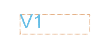

Quick Start
===========

#. Install ParametricText from the `Autodesk® App Store <https://apps.autodesk.com/All/en/List/Search?isAppSearch=True&searchboxstore=All&facet=&collection=&sort=&query=parametrictext>`__. (See :ref:`Installation` for details and alternatives.)

#. Start Fusion 360™.

#. Create a sketch and add a text that says "PARAM".

#. Click *MODIFY* -> *Change Text Parameters*

#. Select the first element in the list.

#. Click on the "PARAM" text.

#. Enter ``V{_.version}`` in the text box.

#. Click *OK*.

.. Update the number starting the next list, if this list is updated!

Your text is now displaying the document version. Try saving the document.

You can also use the value of a numeric parameter:

9. Click *MODIFY* -> *Change Parameters*

#. Create a new parameter named "param" and give it a value.

#. Close the *Parameters* dialog.

#. Click *MODIFY* -> *Change Text Parameters*.

#. Update the text box to say ``{param}``.

#. Click *OK*.

Your text has been updated to show the value of the parameter "param".

For more details on parameter values and formatting, see :ref:`Parameters`.

