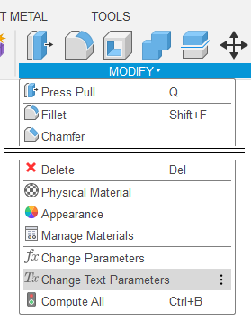
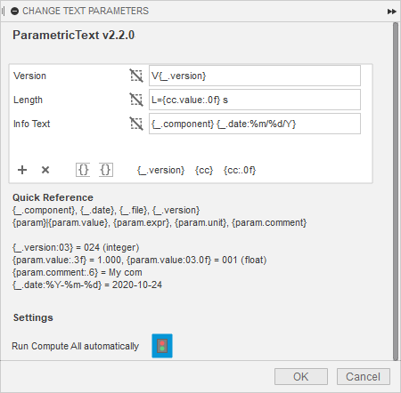

User Interface
==============

Please see the `Demo
video <https://knowledge.autodesk.com/support/fusion-360/learn-explore/caas/screencast/Main/Details/3d4a64a7-37b3-4551-83c4-a93a4d96bca7.html>`__
for a quick overview of ParametricText.

Before you open the parameter dialog, you want to prepare a sketch with a text to assign a parameter to.

ParametricText is accessed through :guilabel:`MODIFY` -> :guilabel:`Change Text
Parameters` in the Design workspace and :guilabel:`MANAGE` -> :guilabel:`Change Text
Parameters` in the Manufacture workspace.

Due to Fusion API limitations, ParametricText is not added to a menu in the Flat pattern environment. As a workaround, you can assign a keyboard shortcut to "Change Text Parameters".

|img_menu|

Parameter Dialog
----------------

 |img_dialog|

.. .. note:: Depending on the state of Fusion's add-in functionality,
          not all properties of a text are retained when a text is
          updated by an add-in. It is therefore recommended to assign
          a text parameter value to a text before customizing the text.

Parameter Table
---------------

All text parameters are listed in the parameter table. Each parameter can be assigned to one or more sketch texts.

Use the |btn_add| and |btn_remove| buttons to add and remove rows from the table.

.. |btn_add| image:: images/resources/add/16x16.png
   :class: guilabel
             
.. |btn_remove| image:: images/resources/remove/16x16.png
   :class: guilabel

Editing a parameter
-------------------

Start by selecting the row of the text parameter to edit.

Click on texts on the canvas to select/unselect for use with the
selected text parameter. The names of the sketches will appear on the
row. Use the clear button, |btn_clear_selection|, to clear all selections.

.. :guilabel:`⛞`

Enter the desired parameter text in the text field. The text can
contain values from parameters and the document. See
:ref:`Parameters` for details.

.. |btn_append_braces| image:: images/resources/append_braces/16x16.png
                       :class: guilabel
.. |btn_prepend_braces| image:: images/resources/prepend_braces/16x16.png
                        :class: guilabel
.. |btn_clear_selection| image:: images/resources/clear_selection/16x16.png
                         :class: guilabel

Fusion does not support writing curly braces on all international
keyboard layouts. |btn_prepend_braces| and |btn_append_braces| can be
used instead, to add curly braces to the beginning and end of the
currently selected text box.

.. |btn_param| replace:: :guilabel:`{parameter}`

The various buttons with braces (:guilabel:`{...}`) allows for quickly inserting parameters.

.. _settings:

Settings
--------

*Run Compute All automatically*
  Make ParametricText run *Compute All* every time text parameters are updated. This can be needed for geometry depending on the texts to be redrawn. Text updates will be slower.

*Troubleshooting mode*
  Used for troubleshooting bugs. Make ParametricText log its actions and the current sketch states in the Fusion text commands terminal. When enabled, the terminal will open. Press :kbd:`Ctrl+Alt+C` to open and close the terminal. Troubleshooting mode can make Fusion run slower.

Disabling ParametricText
------------------------

The add-in can be temporarily disabled using the *Scripts and Add-ins*
dialog. Press :kbd:`Shift+S` in Fusion and go to the *Add-Ins* tab.
